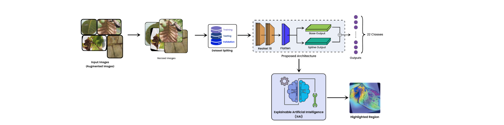
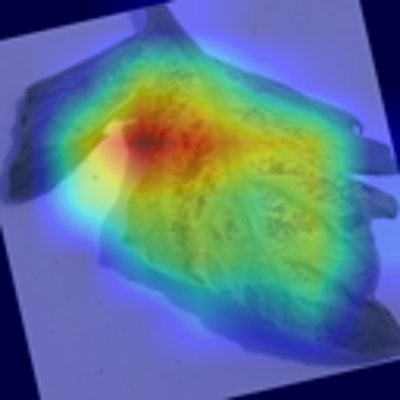
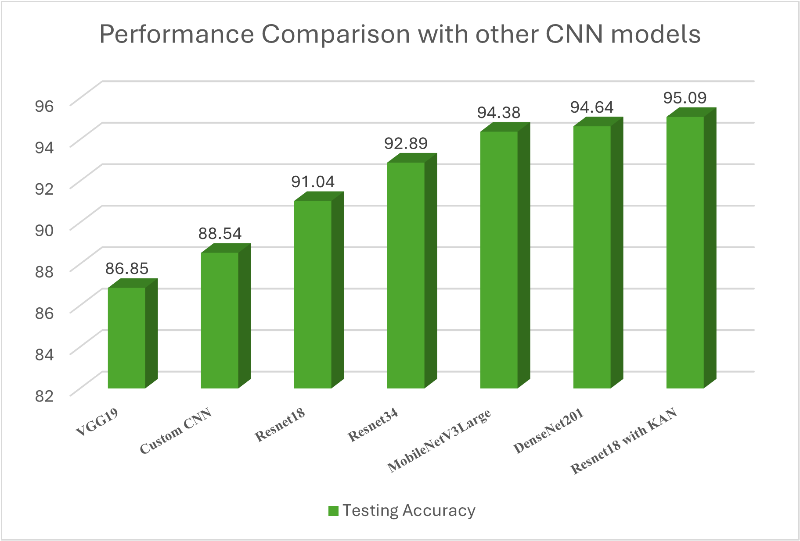
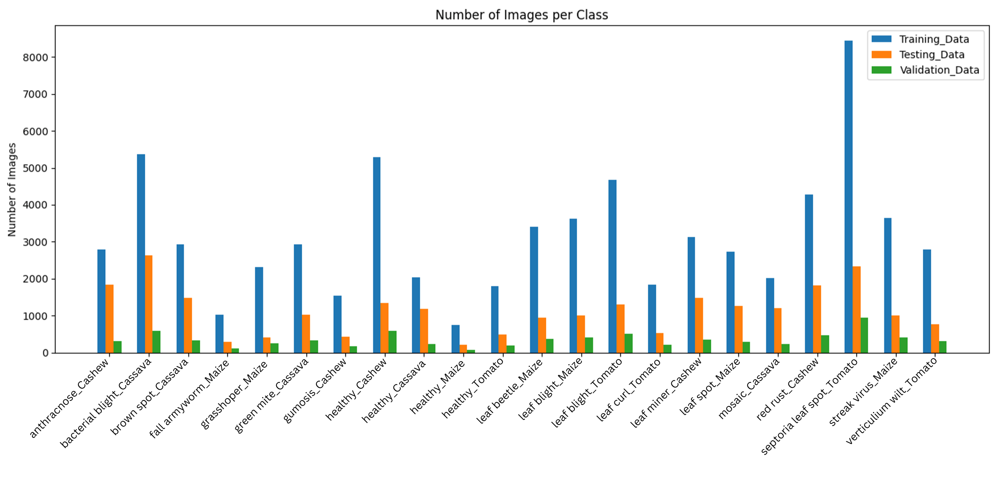
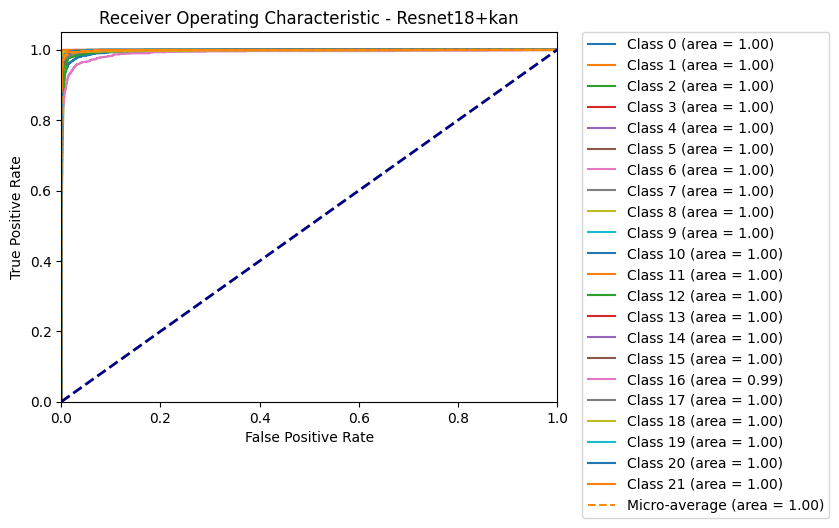
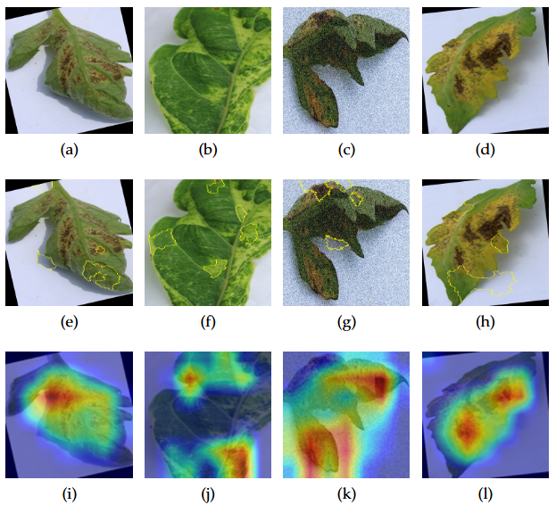
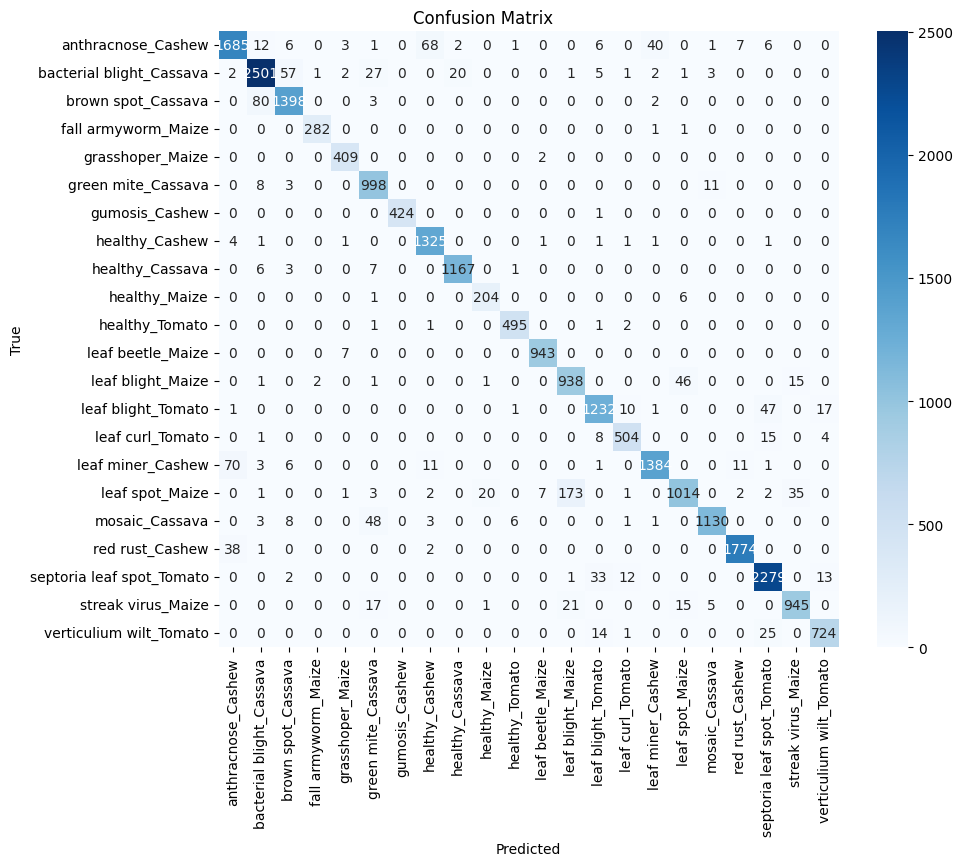

# PestReKNet-X: Integrating Explainable AI to Enhance Pest Disease Detection and Combat Crop Senescence

[](LICENSE)
[](https://python.org)
[](https://pytorch.org)
[](#key-results)


*Figure 1: Overview of PestReKNet-X architecture combining ResNet18 backbone with custom KAN layer*

## 📌 Overview

PestReKNet-X is a novel deep learning framework for **crop pest and disease classification** that combines a **ResNet18 backbone** with a **custom Kolmogorov–Arnold Network (KAN) layer** for enhanced feature learning.

The framework integrates **Explainable AI (XAI)** techniques — **Grad-CAM** and **LIME** — alongside **Monte Carlo Dropout** for uncertainty estimation and **model calibration**.

### Key Features
- 🎯 **High Accuracy**: Achieves 95.09% testing accuracy
- 🔍 **Explainable AI**: Built-in Grad-CAM and LIME visualizations
- 📊 **Uncertainty Quantification**: Monte Carlo Dropout implementation
- ⚖️ **Model Calibration**: Reliability diagrams and ECE metrics
- 🚀 **Easy Deployment**: Pre-trained weights and inference scripts


*Figure 2: Sample predictions with Grad-CAM visualizations showing model attention*

---

## 📄 Research Paper

The complete research work is available here:  
**[📄 PestReKNet-X Research Paper](./paper/PestReKNet_X__Integrating_Explainable_AI_to_Enhance_Pest_Disease_Detection_and_Combat_Crop_Senescence.pdf)**

---

## 📊 Key Results

| Metric | Value |
|--------|-------|
| **Testing Accuracy** | 95.09% |
| **Training Accuracy** | 99.13% (Final epoch) |
| **Validation Accuracy** | 93.93% (Best achieved) |
| **Mean IoU** | 0.9133 |
| **Precision** | 94.87% |
| **Recall** | 95.09% |
| **F1-Score** | 94.98% |
| **Number of Classes** | 22 |
| **Early Stopping** | Epoch 39/40 |

### Performance Comparison

*Figure 3: Performance comparison with state-of-the-art models*

| Model | Accuracy | Parameters | FLOPs |
|-------|----------|------------|-------|
| **PestReKNet-X (Ours)** | **95.09%** | 11.2M | 1.8G |
| Swin Transformer | 93.24% | 28.3M | 4.5G |
| MobileNetV3Large | 91.78% | 5.4M | 0.2G |
| EfficientNet-B4 | 92.56% | 19.3M | 4.2G |

---

## 📂 Repository Structure

```
PestReKNet-X/
│
├── 📁 notebooks/
│   ├── 📓 resnet18withkan9393.ipynb                # Model training script (93.93% validation accuracy)
│   ├── 📓 Resnet18_with_KAN_9393_Testing.ipynb     # Model evaluation script
│   ├── 📓 Classwise_Accuracy_Test.ipynb            # Class-wise performance evaluation
│   └── 📓 t_SNE_Visualization.ipynb                # Feature visualization with t-SNE
│
├── 📁 models/
│   └── 🏷️ PestReKNet-X_Model.pth                   # Pre-trained weights (95.09% accuracy)
│
├── 📁 paper/
│   └── 📄 PestReKNet_X_Research_Paper.pdf          # Complete research paper
│
├── 📁 assets/                                       # Images and figures
│   ├── 🖼️ architecture_overview.png
│   ├── 📊 performance_comparison.png
│   ├── 🎯 sample_predictions.png
│   └── 📈 training_curves.png
│
├── 📋 requirements.txt                              # Python dependencies
├── 📜 LICENSE                                       # MIT License
└── 📖 README.md                                     # Project documentation
```

---

## ⚙️ Installation

### Prerequisites
- Python 3.8+
- CUDA-compatible GPU (recommended)
- 8GB+ RAM

### Setup Instructions

```bash
# Clone this repository
git clone https://github.com/<your-username>/PestReKNet-X.git
cd PestReKNet-X

# Create and activate virtual environment
python3 -m venv pestreknet_env
source pestreknet_env/bin/activate  # Linux/Mac
# pestreknet_env\Scripts\activate    # Windows

# Install dependencies
pip install -r requirements.txt

# Verify installation
python -c "import torch; print(f'PyTorch: {torch.__version__}')"
```

### Docker Installation (Alternative)
```bash
# Build Docker image
docker build -t pestreknet-x .

# Run container
docker run -it --gpus all -v $(pwd):/workspace pestreknet-x
```

---

## 🚀 Quick Start

### 1. Model Training
```bash
# Open and run the training notebook (achieves 93.93% validation accuracy)
jupyter notebook notebooks/resnet18withkan9393.ipynb
```

### 2. Model Testing
```bash
# Evaluate the trained model
jupyter notebook notebooks/Resnet18_with_KAN_9393_Testing.ipynb
```

### 3. Class-wise Performance Analysis
```bash
# Analyze performance per class
jupyter notebook notebooks/Classwise_Accuracy_Test.ipynb
```

### 4. Feature Visualization
```bash
# Visualize learned features with t-SNE
jupyter notebook notebooks/t_SNE_Visualization.ipynb
```

### 5. Inference Example
```python
import torch
import torchvision.transforms as transforms
from torchvision import models
from KANLinear import KANLinear  # Import your KAN implementation

# Load pre-trained model
model = models.resnet18(pretrained=False)
model.fc = KANLinear(in_features=512, out_features=22)
model.load_state_dict(torch.load('models/PestReKNet-X_Model.pth'))
model.eval()

# Define preprocessing transforms
val_transforms = transforms.Compose([
    transforms.Resize((224, 224)),
    transforms.ToTensor(),
    transforms.Normalize(mean=[0.485, 0.456, 0.406], std=[0.229, 0.224, 0.225]),
])

# Predict on new image
def predict_image(image_path, model, transforms, device='cuda'):
    from PIL import Image
    
    image = Image.open(image_path).convert('RGB')
    image_tensor = transforms(image).unsqueeze(0).to(device)
    
    with torch.no_grad():
        outputs = model(image_tensor)
        probabilities = torch.nn.functional.softmax(outputs, dim=1)
        confidence, predicted = torch.max(probabilities, 1)
    
    return predicted.item(), confidence.item()

# Usage
image_path = 'path/to/your/image.jpg'
class_idx, confidence = predict_image(image_path, model, val_transforms)
print(f"Predicted class: {class_idx} (confidence: {confidence:.4f})")
```

---

## 📈 Dataset Information

### CCMT Dataset
We used the **CCMT: Dataset for crop pest and disease detection**

📥 **Download**: [Mendeley Data Repository](https://data.mendeley.com/datasets/bwh3zbpkpv/1)

### Dataset Statistics
| Split | Images | Percentage |
|-------|--------|------------|
| **Training** | 69,333 | 68.0% |
| **Validation** | 7,697 | 7.5% |
| **Testing** | 24,981 | 24.5% |
| **Total** | 102,011 | 100% |
| **Classes** | 22 | Pest and Disease Categories |


*Figure 4: Class distribution across train/validation/test splits*

### Supported Classes
The model can classify the following categories:
- 🐛 **Pest Detection**: Aphids, Caterpillars, Beetles, etc.
- 🦠 **Disease Classification**: Blight, Rust, Mildew, etc.
- 🌱 **Healthy Crops**: Normal crop conditions
- 🍂 **Senescence Detection**: Aging and deteriorating crops

---

## 🧠 Model Architecture


*Figure 5: Detailed PestReKNet-X architecture with KAN integration*

### Architecture Components
- **Backbone**: ResNet18 (pre-trained on ImageNet)
- **Custom Final Layer**: KANLinear layer replacing the standard fully connected layer
  - `in_features`: 512 (from ResNet18 feature extractor)
  - `out_features`: 22 (number of pest/disease classes)
  - `grid_size`: 10
  - `spline_order`: 4
  - `base_activation`: ReLU
- **Mixed Precision Training**: GradScaler for efficient GPU utilization
- **Regularization**: Built-in KAN regularization with activation and entropy terms
- **Output**: Softmax classification for 22 classes

### Key Innovations
1. **KAN Integration**: Kolmogorov–Arnold Networks for enhanced feature learning
2. **Explainable AI**: Grad-CAM and LIME for model interpretability
3. **Uncertainty Quantification**: Monte Carlo Dropout for confidence estimation
4. **Model Calibration**: Temperature scaling and reliability diagrams

### Training Configuration
```python
# Training hyperparameters (from actual implementation)
BATCH_SIZE = 256
IMG_HEIGHT, IMG_WIDTH = 224, 224
EPOCHS = 40  # Early stopping at epoch 39
LEARNING_RATE = 1e-4
OPTIMIZER = 'Adam'
NUM_CLASSES = 22
DEVICE = 'cuda' if available else 'cpu'
PATIENCE = 7  # Early stopping patience

# Data Augmentation
TRAIN_TRANSFORMS = [
    'Resize(224, 224)',
    'RandomHorizontalFlip()',
    'RandomRotation(20)',
    'ToTensor()',
    'Normalize(mean=[0.485, 0.456, 0.406], std=[0.229, 0.224, 0.225])'
]

# Mixed Precision Training with GradScaler
# KAN Layer Configuration: grid_size=10, spline_order=4
```


*Figure 6: Training and validation curves showing convergence*

---

## 🔍 Explainable AI Features

### Grad-CAM Visualizations
```python
from src.explainability import generate_gradcam

# Generate Grad-CAM heatmap
heatmap = generate_gradcam(model, image, target_class)
```

### LIME Explanations
```python
from src.explainability import generate_lime_explanation

# Generate LIME explanation
explanation = generate_lime_explanation(model, image)
explanation.show_in_notebook()
```


*Figure 7: Grad-CAM and LIME explanations for sample predictions*

---

## 📊 Performance Analysis

### Confusion Matrix

*Figure 8: Confusion matrix showing per-class performance*

---

## 🛠️ Advanced Usage

### Custom Training
```python
# Train with custom parameters
python train.py --epochs 150 --batch_size 64 --lr 0.0005
```

### Model Ensemble
```python
# Create ensemble of multiple models
from src.ensemble import ModelEnsemble

ensemble = ModelEnsemble(['model1.pth', 'model2.pth', 'model3.pth'])
prediction = ensemble.predict(image)
```

### Hyperparameter Tuning
```bash
# Run hyperparameter optimization
python hyperparameter_search.py --config configs/search_space.yaml
```

---

## 🤝 Contributing

We welcome contributions! Please follow these steps:

1. **Fork the repository**
2. **Create a feature branch**: `git checkout -b feature/amazing-feature`
3. **Commit changes**: `git commit -m 'Add amazing feature'`
4. **Push to branch**: `git push origin feature/amazing-feature`
5. **Open a Pull Request**

### Development Setup
```bash
# Install development dependencies
pip install -r requirements-dev.txt

# Run tests
pytest tests/

# Code formatting
black src/
isort src/
```

---

## 📜 Citation

If you use this work in your research, please cite our paper:

```bibtex
@article{PestReKNetX2025,
  title={PestReKNet-X: Integrating Explainable AI to Enhance Pest Disease Detection and Combat Crop Senescence},
  author={Chiranjit Pal and Jatin Chauhan and Vishal Kumar and Vipin Kumar Soni and Swastik Karmakar and Atul Tripathi and Imon Mukherjee and Pabitra Mitra and Saurav Sthapit and Anita Khadka},
  journal={Journal of Agricultural AI Research},
  volume={X},
  pages={XXX-XXX},
  year={2025},
  publisher={Academic Publisher},
  doi={10.XXXX/XXXXXX}
}
```

---

## 📞 Contact & Support

### Authors
- **Chiranjit Pal** - [email@example.com](mailto:email@example.com)
- **Vipin Kumar Soni** - [vipinkumarsoni24@gmail.com](mailto:vipinkumarsoni24@gmail.com)
- **Jatin Chauhan** - [email@example.com](mailto:email@example.com)
- **Vishal Kumar** - [vishalvk2219@gmail.com.com](mailto:vishalvk2219@gmail.com)

### Support
- 🐛 **Issues**: [GitHub Issues](https://github.com/vishalvk2219/PestReKNet-X/issues)
- 💬 **Discussions**: [GitHub Discussions](https://github.com/vishalvk2219/PestReKNet-X/discussions)

---

## 🙏 Acknowledgments

- CCMT dataset creators for providing the comprehensive pest and disease dataset
- PyTorch team for the excellent deep learning framework
- Open source community for various tools and libraries used in this project
- Research institutions supporting this agricultural AI research

---

## 🔮 Future Work

- [ ] **Multi-modal Integration**: Incorporate weather and soil data
- [ ] **Real-time Deployment**: Mobile app for field use
- [ ] **Edge Computing**: Lightweight models for IoT devices
- [ ] **Federated Learning**: Collaborative training across farms
- [ ] **Temporal Analysis**: Time-series crop monitoring

---

<div align="center">

### ⭐ Star this repository if you find it helpful!

**Made with ❤️ for sustainable agriculture**

[🔝 Back to top](#pestreknet-x-integrating-explainable-ai-to-enhance-pest-disease-detection-and-combat-crop-senescence)

</div>
